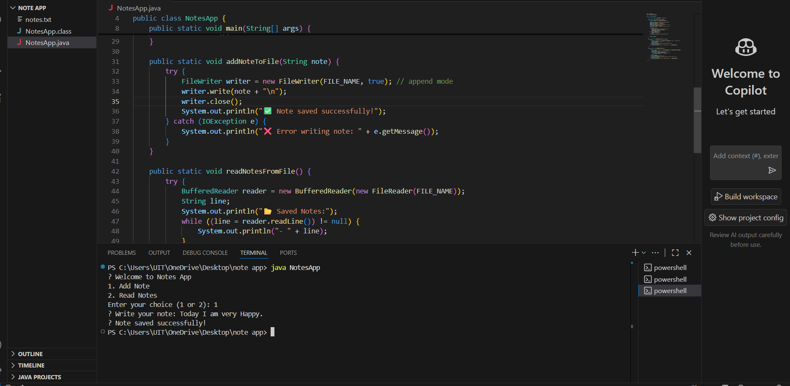

# 📝 Notes App – Java File I/O (Task 4)

> A simple console-based **Notes Manager** built in Java using **FileWriter**, **FileReader**, and **BufferedReader**.  
> Developed as part of the **Java Developer Internship – Task 4: File I/O**.

---

## 📌 Task Description

**Task 4 Objective:**  
Build a text-based **Notes App** using **Java File I/O** where the user can:

- ➕ Add a note (saved to a file)
- 📖 Read all saved notes (from the same file)

### 📚 Key Concepts Covered:
- Java File Handling using `FileWriter`, `FileReader`, and `BufferedReader`
- User input handling using `Scanner`
- Exception handling with `try-catch`
- Basic console menu and file persistence

---

## 💻 Tools Used

- Java
- VS Code (or any Java IDE)
- Terminal / Command Prompt

---


## 🚀 How to Run the Project

1. Open terminal inside the project folder  
2. Compile the Java file:
   ```bash
   javac NotesApp.java

 ## Run the program:

```bash
java NotesApp
```
### 📸 Screenshot



🖋️ *Screenshot added by: **Sudhatanmai***

---
## ✅ Features Implemented
1.Simple console menu for note-taking

2.Notes are saved in a local text file (notes.txt)

3.Notes are appended, not overwritten

4.Error handling for missing files

5.Clean and beginner-friendly code

---

## ✍️ Author
Name: Sudhatanmai

Internship Role: Java Developer Intern

Task: 4 – Java File I/O – Notes App

---

🙌 Thank you for reviewing my project!
Proudly built with Java by Sudhatanmai 💻✨
